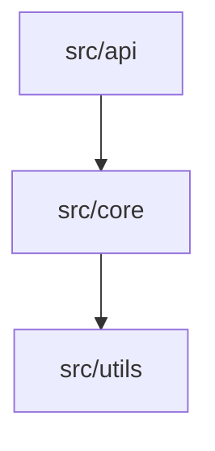
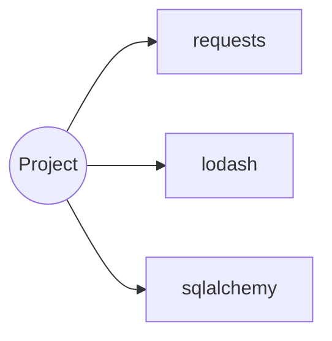

# generate_diagrams

## Purpose
Produce visual, navigable architecture documentation from the dependency graph.

---

## Steps

### 1 — Load graph
Read `/tmp/dependency_graph.json`.
Validate: `nodes`, `edges`, `external_deps` keys present.

### 2 — Module dependency diagram
Generate a Mermaid `graph TD` from internal edges only:



Rules:
- Node label = module short name (no `src/` prefix).
- Direction: top-down (`TD`).
- Group nodes by directory if depth > 2.

### 3 — External dependencies diagram
Generate a separate `graph LR` listing external packages:



### 4 — Write output

`docs/dev/diagrams.md`:

```markdown
# Architecture Diagrams

_Auto-generated by analyze_repo + generate_diagrams. Do not edit manually._

## Module Dependency Graph

```mermaid
<internal graph>
```

## External Dependencies

```mermaid
<external graph>
```

## Legend
- Arrows indicate import/require direction (A → B means A imports B).
- Generated: <ISO timestamp>
```

---

## Validation

- [ ] `docs/dev/diagrams.md` exists
- [ ] Contains at least one `graph` block
- [ ] All nodes in edges also appear in nodes list (no dangling refs)
- [ ] File timestamp matches current run

On failure: emit warning and write a plain-text adjacency list as fallback.
